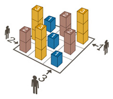

# SKYSCRAPERS

A C program that solves the Skyscrapers puzzle using backtracking.



## Description

The Skyscrapers puzzle consists of a 4x4 grid where each cell must be filled with a number from 1 to 4, representing the height of a skyscraper. The grid must satisfy the following conditions:

1. Each number must appear exactly once in each row and each column.
2. The numbers around the grid indicate how many skyscrapers are visible from that direction, considering
    that taller skyscrapers block the view of shorter ones behind them.
## Usage

Compile the program using make:

```bash
make
```
Run the program with a single argument representing the views around the grid. The views should be provided as a string of 16 numbers (from 1 to 4) separated by spaces, representing the number of visible skyscrapers from each direction (top, bottom, left, right).

```bash
./skyscraper "4 3 2 1 1 2 2 2 2 2 2 1 1 2 3 4"
```

The program will output the solved grid or an error message if the input is invalid or if no solution exists.
## Example
Input:
```bash
./skyscraper "4 3 2 1 1 2 2 2 2 2 2 1 1 2 3 4"
```
Output:
```
1 2 3 4
2 3 4 1
3 4 1 2
4 1 2 3
```